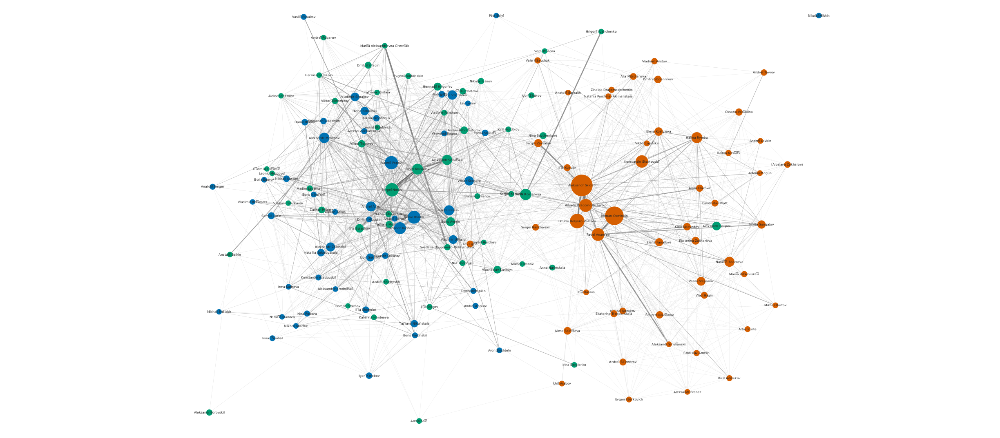
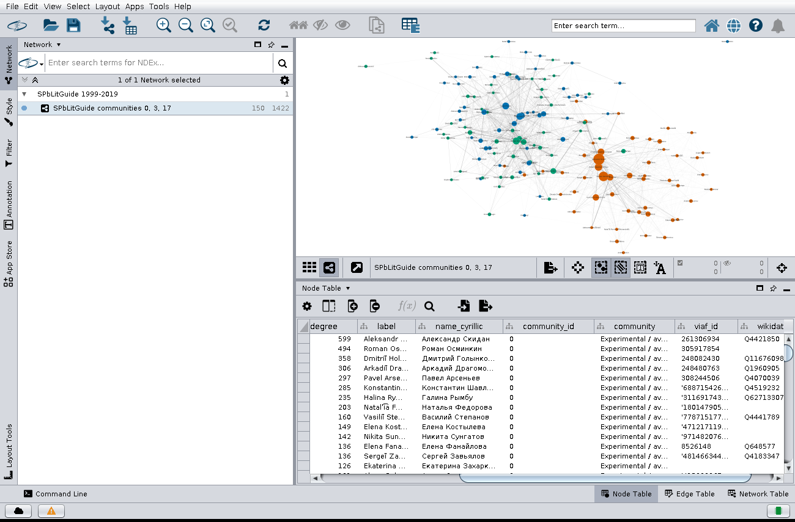

# Literary communities of St. Petersburg in Cytoscape

A small practical exercise following Miriam Posner's tutorial
[Publish your Cytoscape graph](https://miriamposner.com/classes/dh201w21/tutorials-guides/network-analysis/publish-your-cytoscape-graph/)
(Introduction to Digital Humanities, UCLA), applied to a network of literary
events in St. Petersburg, 1999–2019.

**Live page:** https://mary-lev.github.io/spb-literary-network-cytoscape/



## The data

[Literary Events in Saint Petersburg (1999–2019) from SPbLitGuide Newsletters](https://doi.org/10.5281/zenodo.13753154)
(Zenodo, CC BY 4.0): 15,012 events documented in 1,255 issues of the
SPbLitGuide newsletter, each with a list of participants, plus a table of
11,777 persons with VIAF and Wikidata identifiers.

The network is the one analysed in Maria Levchenko,
[*Computational Analysis of Literary Communities*](https://jcls.io/article/id/4217/),
Journal of Computational Literary Studies. Nodes are people; two people are
linked when they took part in the same event. An event with *n* participants
adds 1/(*n*−1) to the weight of every pair, so small readings count more than
large festival panels, and weights are summed over all shared events.

The full network has 10,656 nodes and 106,127 edges. That is far too much for a
browser, so this exercise keeps the 50 most connected members of three
communities that the article validates against known aesthetic groupings:

| Community | Description | Key figures in the article |
|---|---|---|
| 0 | Experimental / avant-garde poetry (the Translit circle) | Alexander Skidan, Pavel Arseniev, Arkady Dragomoshchenko |
| 3 | Literary traditionalism, the “thick journals” *Zvezda* and *Neva* | Yakov Gordin, Andrey Ariev, Alexander Kushner |
| 17 | “New prose”, the Petersburg Fundamentalists | Pavel Krusanov, Sergey Nosov, Alexander Sekatsky |

Community membership comes from the Louvain partition published with the
article's companion site ([literary-communities.vercel.app](https://literary-communities.vercel.app/),
[source](https://github.com/mary-lev/literary_communities)).

## What was done

1. **Data preparation** — `scripts/prepare_data.py` downloads the two Zenodo
   files and the community assignments, rebuilds the co-participation network
   with NetworkX and checks it against the article (10,656 nodes, 106,127
   edges, 387 components: all reproduced exactly; the giant component comes out
   at 9,622 nodes against 9,621 in the article). It then writes
   `data/nodes.csv` and `data/edges.csv` for the 150-node slice (1,422 edges).
2. **Cytoscape** — `scripts/build_in_cytoscape.py` drives Cytoscape 3.10.3
   through its REST interface (py4cytoscape): import the edge and node tables,
   create a visual style (colour by community, node size by degree, edge width
   and colour by weight, transliterated name labels), run the
   Kamada–Kawai layout (topology only: with edge weights Cytoscape treats the weight
   as an edge length, which mixes the groups), then nudge apart the few nodes the layout left
   overlapping (Kamada–Kawai ignores node size, and two big nodes drawn on top
   of each other make their shared edges look doubled).
3. **Publishing, option 1** — export a static image:
   `cytoscape/network.png`.
4. **Publishing, option 2** — export *Network and View* as Cytoscape.js JSON
   (`cytoscape/network.cyjs`) and the style as *Style for cytoscape.js*
   (`cytoscape/style.json`), exactly as in the tutorial. The session is saved
   as `cytoscape/spb_literary_network.cys` and can be opened in Cytoscape.
5. **Web page** — `index.html`, served by GitHub Pages, loads the two exported
   files with Cytoscape.js and shows the network with pan, zoom, search and a
   detail panel for each person.



### A note on CyNetShare

The tutorial's last step uploads the two files to GitHub Gists and pastes
their raw URLs into CyNetShare (cynetshare.ucsd.edu). As of September 2026 that
service is offline (the host no longer answers), so this repository hosts the
files itself and `index.html` does what CyNetShare did: render the exported
network and style with Cytoscape.js. The tutorial itself notes that any server
able to host the two files is fine.

A few quirks of Cytoscape's exporter are worth knowing. The plain *Export
Network* command omits node positions, so the script fetches the network
*view* through CyREST, which is what *Export Network and View* produces. Locked
node size is not written to the cytoscape.js style, so width and height are
mapped separately. Opacity values come out on Cytoscape's 0–255 scale
(Cytoscape.js expects 0–1) and the Java font name `SansSerif.plain` is not a
CSS font family; the page converts both on load rather than editing the exported
file. Wide translucent edges are drawn with a visible outline in the PNG export,
which looks like doubled edges, so weak ties are faded by colour instead.
Finally, Cytoscape writes decimal numbers with the system locale, so it must run
under an English locale (`LC_ALL=C.UTF-8`) for the mappings to be valid.

## Outcome

An assessment of the tutorial after running every step of it.

**Clear.** The writing is very good for its audience. Each step is one action
with one annotated screenshot, the two options are explained up front with an
honest "this one is fiddly" warning, and the prerequisites are linked. The
distinction it insists on, *Export Network and View* rather than *Export
Network*, turned out to be the single most important detail: the plain export
has no node positions, and that is exactly the bug I hit when driving Cytoscape
by script instead of by menu.

**Clean.** It is honest about its own weak spot. It says CyNetShare "can be a
bit buggy" and lists workarounds, and it says Gist is only a stand-in for anyone
with a real server. That framing is what made it legitimate to replace
CyNetShare with GitHub Pages without departing from the tutorial's intent.

**Workable in 2026, only partly.**

- Option 1, the static image, works exactly as described.
- Option 2 works up to step 8. Cytoscape 3.10 still has the same menus, the
  `.cyjs` and *Style for cytoscape.js* exports exist, and Gists still work.
- Step 9 is dead. The CyNetShare host refuses connections, and both example
  links are expired goo.gl shortlinks. A student following the page today
  reaches a wall with no explanation. The fix, a small HTML page that loads the
  two exported files with Cytoscape.js, is easy, but the tutorial does not
  mention it, so a beginner would not know it exists.

**What the tutorial does not prepare you for.** These cost time here and would
also meet a student on a laptop:

- Cytoscape writes decimal numbers in the system locale. On an Italian machine
  the style file came out with commas and silently broke every mapping in the
  browser. The tutorial assumes an English locale without saying so.
- The style export is only approximately Cytoscape.js: opacity comes out on a
  0–255 scale, the font name is a Java name, and locked node size is dropped.
  CyNetShare presumably patched these itself; without it, the page has to.
- Layout is not covered at all, yet it decides whether the published graph
  says anything. Kamada–Kawai with the weight attribute treats weight as edge
  length and mixed the communities, and it ignores node size, so large nodes
  overlapped and their shared edges looked doubled.
- Scale is never discussed. A learner with a real dataset will discover that
  Cytoscape.js in a browser needs a subgraph of at most a few thousand edges.
  Choosing that slice is the real intellectual work of the exercise, and the
  tutorial's toy dataset hides it.

**Verdict.** As a lesson it is a model of how to write a tutorial. As a recipe
it has one broken step and several hidden assumptions, so it now needs an
instructor's note: skip CyNetShare and host the two files on GitHub Pages with a
small Cytoscape.js page, run Cytoscape under an English locale, and choose a
subgraph before you start. Each of these points is applied in this repository.

## Tools used

- Cytoscape 3.10.3 with py4cytoscape 1.13 (import, style, layout, export)
- Python 3.10, pandas, NetworkX (data preparation and verification)
- Cytoscape.js 3.30 (interactive rendering)
- GitHub and GitHub Pages (hosting)

## Reproduce

```bash
python3 -m venv .venv && .venv/bin/pip install "pandas<3" networkx py4cytoscape requests
.venv/bin/python scripts/prepare_data.py          # downloads ~18 MB from Zenodo
# start Cytoscape 3.10 (GUI); on a headless Linux box:
#   Xvfb :99 -screen 0 1600x1000x24 &
#   DISPLAY=:99 LC_ALL=C.UTF-8 sh -c 'sleep infinity | ./cytoscape.sh' &
.venv/bin/python scripts/build_in_cytoscape.py    # writes cytoscape/*
python3 -m http.server 8000                       # open http://localhost:8000/
```

## Repository layout

```
data/      nodes.csv, edges.csv (the 150-node slice); raw/ is downloaded, not committed
scripts/   prepare_data.py, build_in_cytoscape.py
cytoscape/ network.png, network.cyjs, style.json, spb_literary_network.cys, screenshot
index.html the GitHub Pages site
```

## Licence and credits

Data: CC BY 4.0, Maria Levchenko (University of Bologna); newsletter compiled by
Daria Sukhovey. Code in this repository: MIT.
